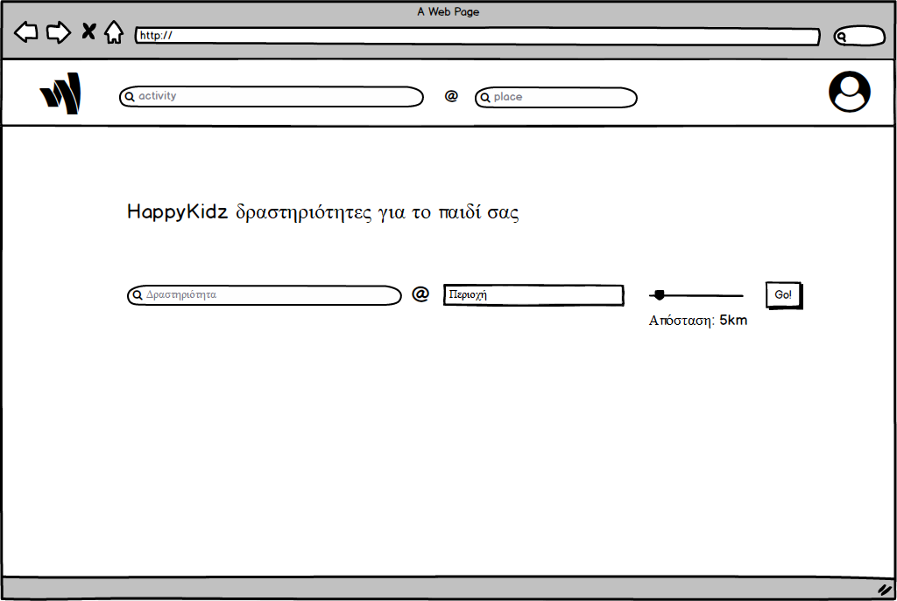
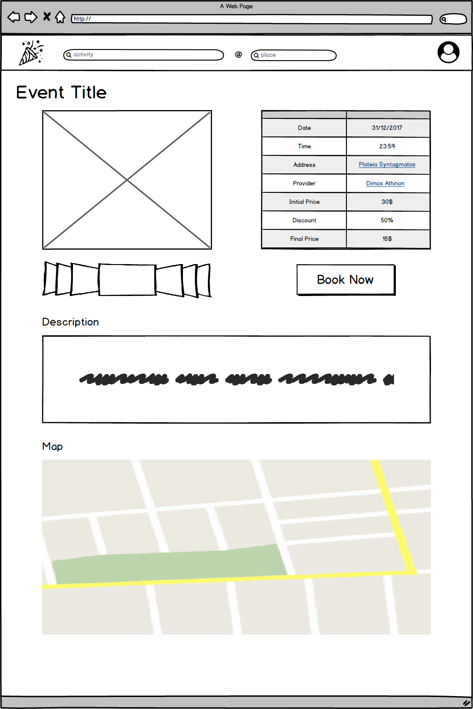
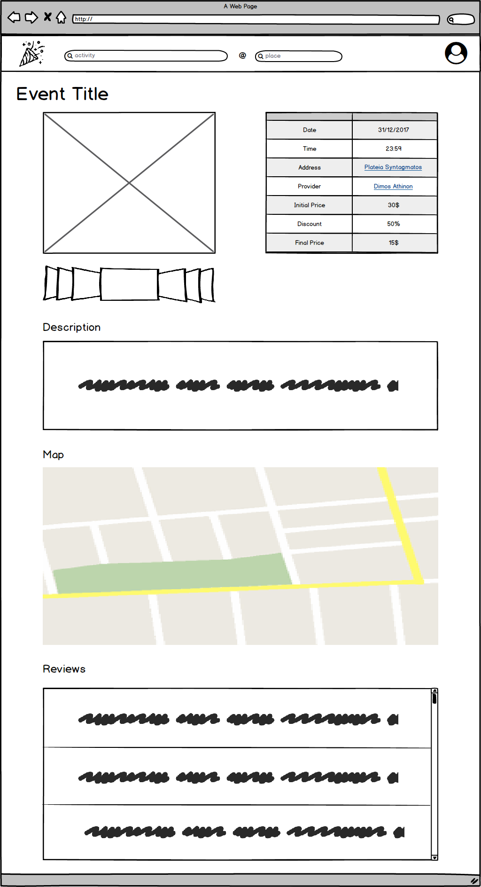
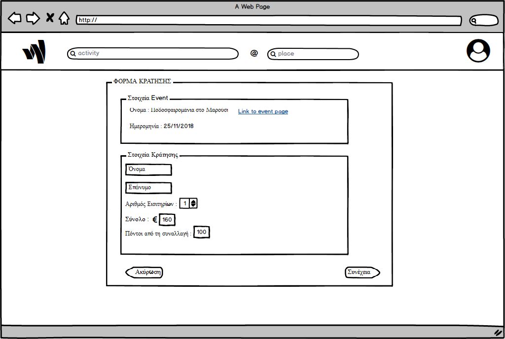
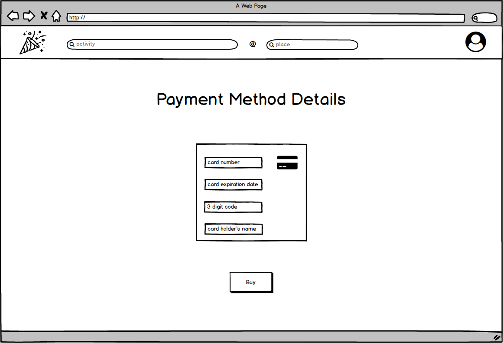
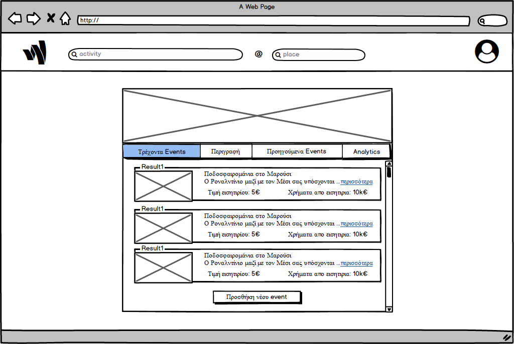
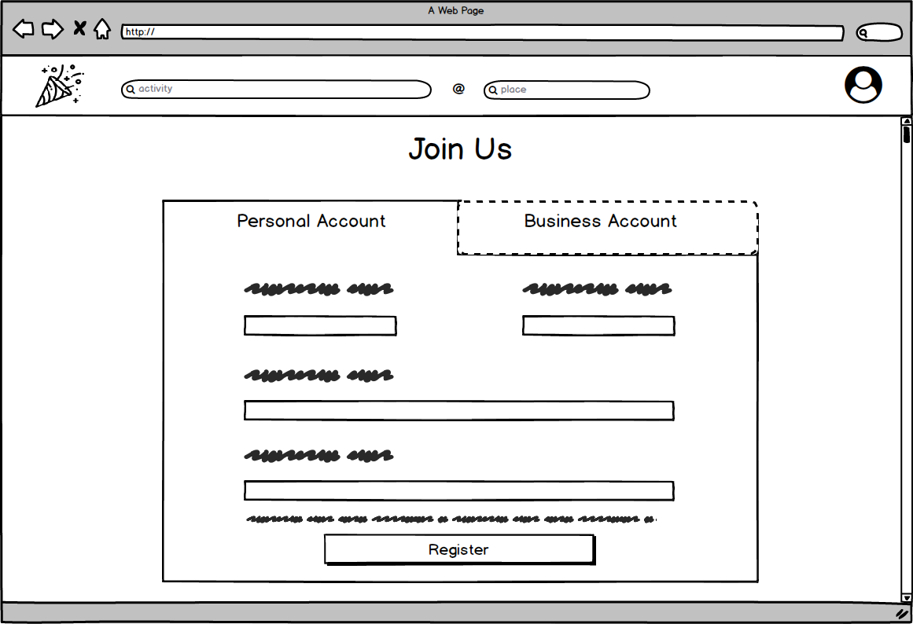
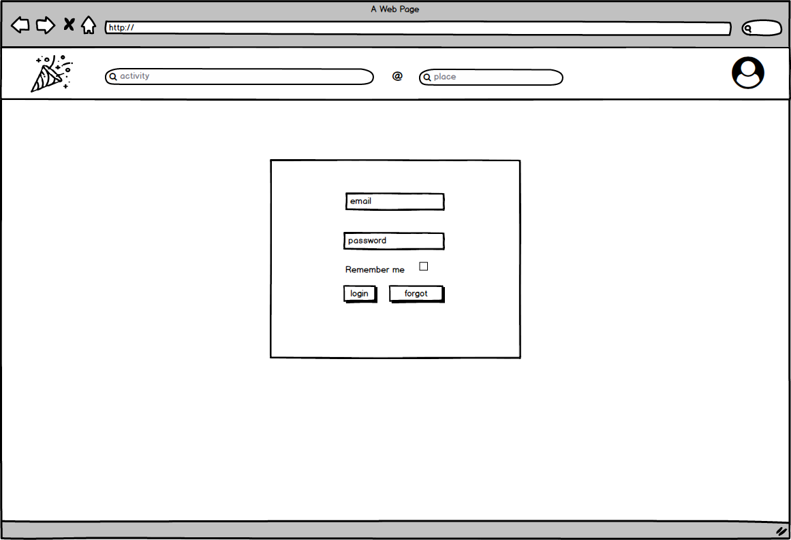
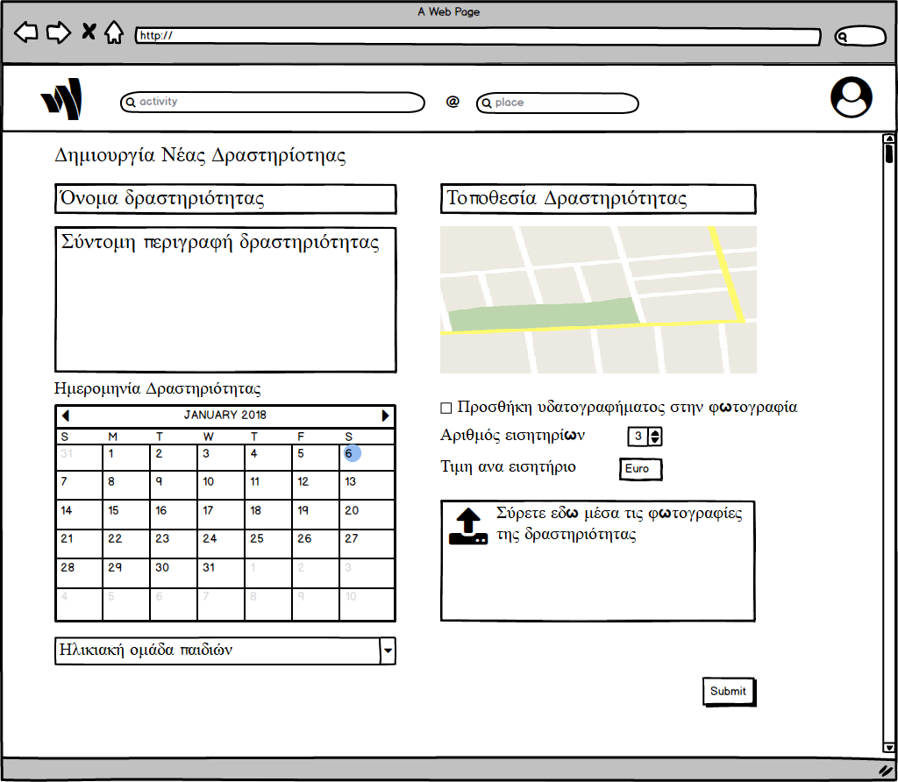

# Happy Kidz

# Γενικά
## Σκοπός του συστήματος

&nbsp;&nbsp;&nbsp;&nbsp;&nbsp;&nbsp;&nbsp;Το σύστημα υλοποιεί μια διαδικτυακή πλατφόρμα(webpage) που βοηθά τους γονείς να επιλέξουν δραστηριότητες για τα παιδιά τους. Πιο συγκεκριμένα, παρέχεται διασύνδεση παρόχων υπηρεσιών διασκέδασης και δημιουργικής απασχόλησης για άτομα σχετικά μικρής ηλικίας, με τους γονείς - κηδεμόνες τους. Ακόμα, στοχεύουμε στην διευκόλυνση και στον εκσυγχρονισμό της διαδικασίας εύρεσης τέτοιου είδους δραστηριοτήτων. Ειδικότερα, παρέχουμε διαφόρων ειδών επιλογές στους γονείς για τις δραστηριότητες του παιδιού τους (με βάση το κόστος, την ηλικία, την γεωγραφική απόσταση κτλ). Το ηλεκτρονικό πορτοφόλι θα αποτελέσει τη βάση πάνω στην οποία θα στηριχθεί ένα σύστημα επιβράβευσης των γονιών που έχουν πολλές συναλλαγές με παρόχους. Επίσης, το σύστημα θα δίνει τη δυνατότητα σε γονείς να αξιολογούν τις δραστηριότητες.

## Λειτουργικές Απαιτήσεις

&nbsp;&nbsp;&nbsp;&nbsp;&nbsp;&nbsp;&nbsp;Το σύστημα μας υποστηρίζει τέσσερις ρόλους χρηστών στην πλατφόρμα, τους ανώνυμους χρήστες, τους γονείς, τους παρόχους υπηρεσιών και τους διαχειριστές.

&nbsp;&nbsp;&nbsp;&nbsp;&nbsp;&nbsp;&nbsp;Την πρώτη φορά που εισέρχεται ένας νέος γονιός - χρήστης της εφαρμογής, έχει τη δυνατότητα να δημιουργήσει λογαριασμό συμπληρώνοντας τα στοιχεία και τις προτιμήσεις του, τα οποία μπορεί στη συνέχεια να επεξεργαστεί. Έτσι, το σύστημα θα κάνει εξατομικευμένες προτάσεις και θα προσφέρει όσο το δυνατόν καλύτερη εμπειρία χρήσης. Αφού εισέλθει με τον λογαριασμό του έχει τη δυνατότητα να αναζητήσει τις εκδηλώσεις που τον ενδιαφέρουν κάνοντας χρήση ελευθέρου κειμένου και χρησιμοποιώντας διάφορα κριτήρια αναζήτησης, όπως γεωγραφική απόσταση, είδος εκδήλωσης, κόστος εισιτηρίου, ημερομηνία εκδήλωσης, ηλικιακό εύρος της εκδήλωσης, καθώς και συνδυασμούς τους. Αφού βρει την εκδήλωση που τον ενδιαφέρει και υπάρχει διαθεσιμότητα, ο γονέας έχει τη δυνατότητα να κλείσει εισιτήριο μέσω της πιστωτικής του κάρτας. Με κάθε αγορά ενός εισιτηρίου, ο γονέας λαμβάνει κάποιους πόντους επιβράβευσης, τους οποίους μπορεί μετά να χρησιμοποιήσει για να λάβει εκπτώσεις στην πλατφόρμα μας. Ανά πάσα στιγμή μπορεί να ελέγξει στον λογαριασμό του τον αριθμό των πόντων που έχει συλλέξει. Αφού πραγματοποιηθεί η αγορά, στη συνέχεια αποστέλλεται στον γονέα ένα e-mail με το εισιτήριο του. Επίσης στον λογαριασμό του μπορεί να δει τα εισιτήρια που έχει αγοράσει και να επιλέξει να του αποσταλεί ξανά το εισιτήριο. Μετά το τέλος της εκδήλωσης εφόσον έχει αγοράσει εισιτήριο θα έχει τη δυνατότητα αξιολόγησης. Τέλος, ο γονέας θα έχει την δυνατότητα να κάνει subscribe στους αγαπημένους του παρόχους λαμβάνοντας έτσι emails σχετικά με νέα events που αυτοί διοργανώνουν.

&nbsp;&nbsp;&nbsp;&nbsp;&nbsp;&nbsp;&nbsp;Οι πάροχοι  έχουν τη δυνατότητα αρχικά να δημιουργήσουν λογαριασμό όπου θα συμπληρώνουν τα στοιχεία της εταιρείας μαζί με ένα αναγνωριστικό έγγραφο, ώστε να γίνει εξακρίβωση των στοιχείων που παρουσιάζουν. Αφού φτιάξουν το λογαριασμό έχουν τη δυνατότητα να “ανεβάσουν” εκδηλώσεις συμπληρώνοντας στοιχεία σχετικά με αυτές, όπως το πλήθος και την τιμή των εισιτηρίων, την τοποθεσία και την ώρα διεξαγωγής, το ποσοστό έκπτωσης καθώς  και σχετικές φωτογραφίες. Για την προστασία των πνευματικών δικαιωμάτων των φωτογραφιών θα υπάρχει η επιλογή να χρησιμοποιηθούν υδατογραφήματα του παρόχου. Θα μπορούν να βλέπουν τον αριθμό θέσεων που έχουν κρατηθεί μέχρι στιγμής για κάθε event που διοργανώνουν και το ποσό χρημάτων που τους αναλογεί για κάθε εκδήλωση. Θα έχουν επίσης τη δυνατότητα να δουν αναλυτικές κριτικές και βαθμολογίες των χρηστών στις δραστηριότητες που έχουν διεξαχθεί μέχρι στιγμής καθώς και άλλα στατιστικά στοιχεία.

&nbsp;&nbsp;&nbsp;&nbsp;&nbsp;&nbsp;&nbsp;Οι administrators μετά από είσοδο με ειδικά credentials που θα έχουν προμηθευτεί από τη διεύθυνση της πλατφόρμας θα έχουν την δυνατότητα να δουν μία λίστα με τους εγγεγραμμένους γονείς, να μπλοκάρουν κάποιο γονιό ή να κάνουν reset το password κάποιου γονιού. Ακόμα θα μπορούν να δουν μία λίστα με τους λογαριασμούς των παρόχων, να τους εγκρίνουν και να τους διαγράψουν αν κριθεί απαραίτητο. Ακόμα θα έχουν την δυνατότητα να εγκρίνουν την δημιουργία καινούριων event. Επίσης θα έχει πρόσβαση και σε μία λίστα με τα ολοκληρωμένα event τα οποία δεν έχουν ακόμα πληρωθεί στον πάροχο, έτσι ώστε να μπορεί να εγκρίνει την πληρωμή.

&nbsp;&nbsp;&nbsp;&nbsp;&nbsp;&nbsp;&nbsp;Οι ανώνυμοι χρήστες έχουν τη δυνατότητα να δουν όλες τις υπάρχουσες δραστηριότητες καθώς και να κάνουν αναζητήσεις όπως οι εγγεγραμμένοι γονείς χωρίς να μπορούν όμως να κάνουν αγορές και να επωφεληθούν από τις προσφορές που υπάρχουν. Δεν θα τους επιτρέπεται να αξιολογούν events, αλλά μόνο να βλέπουν τις υπάρχουσες αξιολογήσεις των εγγεγραμμένων χρηστών.

## Μη λειτουργικές απαιτήσεις

&nbsp;&nbsp;&nbsp;&nbsp;&nbsp;&nbsp;&nbsp;Η εφαρμογή θα πρέπει να προστατεύει τα δεδομένα των χρηστών, κρατώντας τα κρυπτογραφημένα, έτσι ώστε να μην μπορεί κάποιος χρήστης να δει δεδομένα άλλου χρήστη, εκτός και αν αυτό προβλέπεται ρητά από την υπηρεσία.

&nbsp;&nbsp;&nbsp;&nbsp;&nbsp;&nbsp;&nbsp;Ακόμα θα πρέπει οι χρήστες να μην μπορούν να αλλάξουν δεδομένα πέρα από τους καθορισμένους από την υπηρεσία τρόπους (η εφαρμογή θα πρέπει να είναι ασφαλής και να αντέχει σε επιθέσεις).

&nbsp;&nbsp;&nbsp;&nbsp;&nbsp;&nbsp;&nbsp;Το σύστημα να βασίζεται σε ένα διαδεδομένο και καλά υποστηριζόμενο λειτουργικό σύστημα, πχ ubuntu, ενώ όλη η υποδομή του backend θα πρέπει να περιοριστεί στα πλαίσια ενός lan. Όσον αφορά το frontend θα πρέπει υποστηρίζεται από τους εξής browsers : Chrome, Firefox.

&nbsp;&nbsp;&nbsp;&nbsp;&nbsp;&nbsp;&nbsp;Ένας χρήστης απαιτεί να συναλλάσσεται με ηλεκτρονικό πορτοφόλι, συνεπώς πρέπει να υπάρχει μέριμνα για την εξυπηρέτηση ταυτόχρονων συναλλαγών με ό,τι αυτό συνεπάγεται.

&nbsp;&nbsp;&nbsp;&nbsp;&nbsp;&nbsp;&nbsp;Η πλατφόρμα θα πρέπει να συμμορφώνεται με όλες τις ευρωπαϊκές και διεθνείς προδιαγραφές σχετικές με την προστασία προσωπικών δεδομένων (π.χ. να ενημερώνει τους χρήστες για τα cookies).

## Εμβέλεια-Παραδοχές-Περιορισμοί

&nbsp;&nbsp;&nbsp;&nbsp;&nbsp;&nbsp;&nbsp;Η γλώσσα της πλατφόρμας μας θα είναι τα ελληνικά, αφού απευθυνόμαστε στον ελλαδικό χώρο. Για τον ίδιο λόγο, το σύστημα μας θα εμφανίζει όλες τις αναγραφόμενες τιμές σε ευρώ. Οι πόντοι που θα δίνονται ως επιβράβευση θα μπορούν να χρησιμοποιηθούν για αγορές μόνο στην πλατφόρμα, ενώ δε θα μπορούν να ανταλλάσσονται με χρήματα ούτε να μεταφέρονται ανάμεσα σε χρήστες. Θεωρούμε επίσης ότι υπάρχει κάποιο φυσικό πρόσωπο που σε δεύτερο στάδιο μετά την εγγραφή επιβεβαιώνει τα στοιχεία των παρόχων και των δραστηριοτήτων ώστε να μην υπάρχουν ψευδείς πληροφορίες.

&nbsp;&nbsp;&nbsp;&nbsp;&nbsp;&nbsp;&nbsp;Τα χρήματα για κάποιο event δεν θα μεταφέρονται κατευθείαν στον πάροχο, αλλά θα τα κρατάμε εμείς μέχρι την πλήρωση του event. Εφόσον το event πραγματοποιηθεί κανονικά τα χρήματα θα μεταφέρονται στον λογαριασμό του παρόχου. Στο σύστημά μας δεν θα υλοποιηθούν λειτουργίες backup, προστασίας από επιθέσεις και ανάνηψης από σφάλματα. Για τις λειτουργίες αυτές θα χρησιμοποιηθούν έτοιμες λύσεις που είναι δοκιμασμένες και έχουν υλοποιηθεί σωστά. Επίσης η επεξεργασία των χρηματικών συναλλαγών (πιστωτικές κάρτες) δεν θα γίνεται από εμάς, αλλά από ειδικό API, το οποίο είναι εξουσιοδοτημένο νομικά να εκτελεί συναλλαγές. Τέλος, θα τεθεί κάποιο όριο στον αριθμό φωτογραφιών που μπορεί να ανεβάσει ένας πάροχος για ένα event του, ώστε να μην εξαντλήσουμε τους υπολογιστικούς μας πόρους.

## Επιχειρησιακά ζητήματα

### Βιωσιμότητα πλατφόρμας και ηλεκτρονικό πορτοφόλι

&nbsp;&nbsp;&nbsp;&nbsp;&nbsp;&nbsp;&nbsp;Θα υπάρχουν τρία είδη συνδρομών με διαφορετική χρονική διάρκεια και κόστος, μία τρίμηνη που θα ανέρχεται στα 10 ευρώ, μία εξάμηνη στα 15 ευρώ και μία δωδεκάμηνη στα 25 ευρώ. Με τη συνδρομή αυτή, οι γονείς θα απολαμβάνουν εκπτώσεις σε όλα τα events, οι οποίες θα έχουν κατώτατο όριο 5% και το ύψος τους θα καθορίζεται από τους παρόχους. Με κάθε αγορά εισιτηρίου, οι συνδρομητές θα κερδίζουν πόντους στο ηλεκτρονικό τους πορτοφόλι, με τους οποίους θα κερδίζουν έκπτωση στην ανανέωση της συνδρομής τους. Πιο συγκεκριμένα, για εισιτήρια μέχρι 10 ευρώ θα κερδίζουν 5 πόντους, για εισιτήρια από 10 έως 20 ευρώ θα κερδίζουν 10 πόντους και για εισιτήρια πάνω από 20 ευρώ θα κερδίζουν 15 πόντους. Με τη συγκέντρωση 100-200 πόντων, οι συνδρομητές θα έχουν έκπτωση 30% στην ανανέωση της συνδρομής τους, ενώ με τη συγκέντρωση > 200 πόντων οι συνδρομητές θα έχουν έκπτωση 40% στην ανανέωση της συνδρομής τους. Οι πόντοι ενός χρήστη θα μηδενίζονται με την αγορά νέας συνδρομής.

&nbsp;&nbsp;&nbsp;&nbsp;&nbsp;&nbsp;&nbsp;Δε θα υπάρχει καμία επιπλέον χρέωση στους παρόχους για τη συμμετοχή στην πλατφόρμα, παρά μόνο η κάλυψη των εκπτώσεων στους συνδρομητές - γονείς. Οι εκπτώσεις στα events τους θα καθορίζεται από τους ίδιους, με κατώτατο όριο το 5%. Στην αναζήτηση των event από τους γονείς, τα αποτελέσματα θα εμφανίζονται σε φθίνουσα σειρά προσφορών, γεγονός που τους δίνει κίνητρο να κάνουν μεγαλύτερες εκπτώσεις.

&nbsp;&nbsp;&nbsp;&nbsp;&nbsp;&nbsp;&nbsp;Το μοναδικό συνάλλαγμα το οποίο θα χρησιμοποιείται για την αγοραπωλησία εισιτηρίων είναι το ευρώ. Οι χρήστες κατά την εγγραφή τους στην πλατφόρμα θα έχουν την δυνατότητα να συνδέσουν το προφίλ τους με κάποιο μέσο πληρωμής (πιστωτική κάρτα, χρεωστική κάρτα) ώστε κατά την αγορά της συνδρομής και των εισιτηρίων να επιβαρύνεται ο συνδεδεμένος με το προφίλ λογαριασμός.

### Πολιτική Εισιτηρίων

&nbsp;&nbsp;&nbsp;&nbsp;&nbsp;&nbsp;&nbsp;Η αρχική τιμή του εισιτηρίου θα πρέπει να είναι ίδια με αυτή που ισχύει στα εκδοτήρια του παρόχου (μη συμπεριλαμβανομένης της έκπτωσης που προσφέρει η πλατφόρμα μας).

&nbsp;&nbsp;&nbsp;&nbsp;&nbsp;&nbsp;&nbsp;Με την πληρωμή των εισιτηρίων, ο χρήστης θα λαμβάνει ένα κωδικό που θα αντιστοιχεί στο εισιτήριό του και υποδεικνύοντας το στον πάροχο θα μπορεί να συμμετάσχει στο event.

# Frontend

## Wireframes
Παρακάτω φαίνονται τα wireframes των βασικών σημείων της εφαρμογής.
 
### Wireframe αρχικής σελίδας

### Wireframe σελίδας αποτελεσμάτων αναζήτησης

### Wireframe σελίδας παρουσίασης δραστηριότητας

### Wireframe σελίδας παρουσίασης δραστηριότητας μετά την ολοκλήρωσή της

### Wireframe σελίδας κράτησης εισιτηρίου

### Wireframe σελίδας ολοκλήρωσης αγοράς εισιτηρίου

### Wireframe σελίδας επιτυχημένης αγοράς εισιτηρίου

### Wireframe σελίδας profile παρόχου όπως την βλέπει ο ίδιος

### Wireframe σελίδας profile γονέα

### Wireframe σελίδας εγγραφής στην εφαρμογή

### Wireframe σελίδας εισόδου στην εφαρμογή

### Wireframe σελίδας δημιουργίας νέας δραστηριότητας

## Usecase Diagram

# Backend

## Τεχνολογικό stack

&nbsp;&nbsp;&nbsp;&nbsp;&nbsp;&nbsp;&nbsp;Αποφασίσαμε να κάνουμε χρήση Node.js για τον backend κάνοντας χρήση του express.js. Η τεχνολογία Node.js χρησιμοποιεί ενα event driven και nonblocking IO μοντέλο. Το npm, το οποίο είναι το εργαλείο διαχείρισης πακέτων του nodejs, μας επιτρέπει να χρησιμοποιήσουμε την μεγαλύτερη συλλογή βιβλιοθηκών ανοιχτού κώδικα του πλανήτη. Εφόσον το node είναι javascript runtime ουσιαστικά χρησιμοποιούμε την ίδια γλώσσα προγραμματισμού στο frontend και στο backend. Το γεγονός επιτρέπει και στα 7 μέλη της ομάδας μας να λειτουργούμε ως full stack engineers χρησιμοποιόντας την ίδια γλώσσα προγραμματισμού. To express είναι ενα minimal και flexible node.js web app framework που μας επιτρέπει να σχεδιάσουμε την εφαρμογή κάνοντας γρήγορο prototyping. Επίσης, το express ως framework είναι unopinionated δεν είναι περιοριστικό ως προς την αρχιτεκτονική που θα ακολουθήσουμε. Αρχιτεκτονικά αποφασίσαμε να υλοποιήσουμε μια web εφαρμογή πολλαπλών σελίδων η οποία θα υλοποιεί serverside rendering.
 
&nbsp;&nbsp;&nbsp;&nbsp;&nbsp;&nbsp;&nbsp;Χρησιμοποιούμε ως κύρια βάση δεδομένων την PostgreSQL της οποία το DBMS υλοποιεί ACID transactions. Έτσι μπορούμε να χειριστούμε με σχετική ευκολία την παράλληλη αγορά εισιτηρίων. Ως δευτερεύουσα βάση χρησιμοποιούμε την elasticsearch, στην οποία αποθηκεύουμε ένα αντίγραφο του πίνακα events της PostgreSQL. Η elasticsearch μας επιτρέπει να υλοποιήσουμε την "καλή" αναζήτηση των events, υποβάλλοντας queries διαφόρων τύπων (πχ γεωγραφικά queries, ή ελευθέρου κειμνου).
 
&nbsp;&nbsp;&nbsp;&nbsp;&nbsp;&nbsp;&nbsp;Στο frontend για να υλοποιήσουμε το responsive design αποφασίσαμε να χρησιμοποιήσουμε το bootstrap. Με αυτόν τον τρόπο ικανοποιούμε την απαίτηση υποστήριξης χρηστών που χρησιμοποιούν συσκευή με οποιοδήποτε μεγεθος οθόνης. Χρησιμοποιούμε εκτος απο vanilla js και jquery. Το jquery είναι μια βιβλιοθήκη javascript για το frontend που μας επιτρέπει να γράφουμε σύντομο κώδικα για dom manipulation και event handling.
 
&nbsp;&nbsp;&nbsp;&nbsp;&nbsp;&nbsp;&nbsp;Οι τεχνολογίες που χρησιμοποιήσαμε μας επιτρεπουν να ακολουθήσουμε μια τεχνική rapid prototyping. Σε αντίθεση με την Java η js είναι interpreted οπότε για να τρέξουμε την εφαρμογή μας δεν χρειάζεται να περιμένουμε χρόνο μεταγλώττισης. Επίσης, στο node ορίζουμε τα events που αντιστοιχούν σε routes στην ιστοσελίδα μας και όταν γίνεται ενα http request σε καποιο route ασύγχρονα καλείται το callback εξυπηρέτησης που προσφέρει στον χρήστη το rendered html. Για την αυτόματη εκτέλεση task που σχετίζονται με την εφαρμογή μας όπως lint,start,test θα χρησιμοποιήσουμε το εργαλείο του node grunt. Για την αποστολή email στους χρήστες της πλατφόρμας θα κάνουμε χρήση τoυ module Nodemailer και κάποιο ειδικό mass mail service (πχ. MailChimp).

## Σύνδεση απαιτήσεων με τεχνολογικό stack

### Γονείς - Ανώνυμοι Χρήστες
 * **Δημιουργία λογαριασμού**

Η δημιουργία λογαριασμού γίνεται με παρουσίαση φόρμας και συμπλήρωση των στοιχείων σε αυτή. Τα δεδομένα στέλνονται στον server μας και αποθηκεύονται στην SQL βάση μας, αφού πρώτα ο κωδικός γίνει hash(sha512) με ένα τυχαίο salt.

 * **Αναζήτηση δραστηριοτήτων**

Η σελίδα της αναζήτησης περιέχει όλα τα φίλτρα σε sidebar, όπως φαίνεται και από τα mockups μας. Η αναζήτηση πραγματοποιείται από την elasticsearch, η οποία προσφέρει τις προηγμένες δυνατότητες αναζήτησης που θέτουμε στις απαιτήσεις μας.

 * **Αγορά εισιτηρίου**

Πατώντας σε μία εκδήλωση, εμφανίζεται η σελίδα της εκδήλωσης με τα αναλυτικά στοιχεία. Ο χρήστης μπορεί να αγοράσει εισιτήριο πατώντας το κουμπί για αγορά εισιτηρίου. Σε αυτό το σημείο γίνεται έλεγχος για το αν ο χρήστης είναι συνδεδεμένος και έχει συνδρομή, ώστε να τον προωθήσει στη σελίδα πληρωμής. Στη σελίδα πληρωμής γίνεται η συμπλήρωση των στοιχείων τα οποία επιβεβαιώνονται από τραπεζικό API ώστε να γίνει η αγορά. Παράλληλα πραγματοποιούμε transaction στην sql βάση μας ώστε να σημειώσουμε την συναλλαγή.

 * **Αποστολή mail και pdf ticket με qrcode**

Αφού αγοραστεί το εισιτήριο αποστέλλεται email στον χρήστη με το μοναδικό qrcode του εισιτηρίου, καθώς και με την απόδειξη της αγοράς. Το email αποστέλλεται χρησιμοποιώντας κάποιο ειδικό mass mail service (πχ MailChimp). Το qrcode παράγεται από ειδικό module στον server μας.

 * **Reviews**

Μετά τη λήξη ενός event, θα αποστέλετε στους γονείς ένα email ζητόντας τους να αξιολογήσουν το event. Το email θα περιέχει ένα link για τη σελίδα του event, η οποία μετά τη λήξη του event θα περιέχει μια φόρμα για την αξιολόγηση του event. Αξιολόγηση θα μπορούν να αφήσουν μόνο οι γονείς που έχουν αγοράσει εισιτήριο για το συγκεκριμένο event.

 * **Subscription σε παρόχους και notifications**

Στη σελίδα του εκάστοτε παρόχου υπάρχει subscription button και πατώντας το ο γονιός έχει τη δυνατότητα να λαμβάνει email notifications στην πλατφόρμα μας για τα event που διοργανώνει ο συγκεκριμένος πάροχος.

### Πάροχοι

 * **Δημιουργία λογαριασμού**

Όπως και στους γονείς, η δημιουργία λογαριασμού γίνεται με παρουσίαση φόρμας και συμπλήρωση των στοιχείων σε αυτή. Τα δεδομένα στέλνονται στον server μας και αποθηκεύονται στην SQL βάση μας, αφού πρώτα ο κωδικός γίνει hash(sha512) με ένα τυχαίο salt.

 * **Παρουσίαση πιστοποιητικών εγγράφων**

Κατά την δημιουργία του λογαριασμού του ο πάροχος ανεβάζει απαραίτητα αρχεία ΔΕΚΟ για ταυτοποίηση των στοιχείων του από τους administrators (χειροκίνητα).

 * **Δημιουργία event**

Κάθε καινούργιο event αποθηκεύεται στην postgresql, και αφού εγκριθεί από τον administrator, ένα αντίγραφο του event στέλνεται στην elasticsearch για να είναι αναζητήσιμο.

 * **Προστασία πνευματικών δικαιωμάτων με χρήση υδατογραφήματος στις εικόνες**

Κάθε φωτογραφία που ανεβάζει ένας πάροχος σχετικά με κάποιο event, με χρήση του εξωτερικού module που υλοποιούμε, επισκιάζεται με κείμενο της επιλογής του παρόχου.

 * **Δυνατότητα παρακολούθησης analytics για τα events του**

Κάθε φορά που κάποιος χρήστης “βλέπει” κάποιο event, ή αγοράζει εισιτήριο για κάποιο “event”, καταγράφουμε το γεγονός, έτσι ώστε να μπορούμε να παρουσιάσουμε στατιστικά στην σελίδα του παρόχου για το συγκεκριμένο event.
 

### Διαχειριστές

 * **Είσοδος στο διαχειριστικό περιβάλλον**

Θα υπάρχει ειδικό route, μη προσβάσιμο με σύνδεσμο από το κυρίως site, στο οποίο θα κάνουν login οι διαχειριστές.

 * **Επαναφορά κωδικού και διαγραφή χρηστών**

Μέσω ειδικού interface που συνδέεται με τη βάση μας, θα υπάρχουν κουμπιά που θα επιτελούν όλες τις διαχειριστικές λειτουργίες.

## UML Διαγράμματα

Τα διαγράμματα UML βελτιώνουν την κατανόηση του συστήματος τόσο από τρίτους όσο και από εμάς. Μέσω της οπτικής αναπαράστασης γίνονται φανερά τα χαρακτηριστικά της αρχιτεκτονικής μας, τα πλεονεκτήματα και τα μειονεκτήματά της. Για τη συγκεκριμένη περίπτωση, θεωρήσαμε χρήσιμο να κατασκευάσουμε τα διαγράμματα UML τύπου Class Diagram, Component Diagram και Deployment Diagram.

### Class Diagram

### Component Diagram

### Deployment Diagram

## Βάση Δεδομένων

Μια μεγάλη σχεδιαστική απόφαση αποτελεί η επιλογή του τύπου και ο σχεδιασμός του σχήματος της βάσης. Ώς κύρια βάση (source of truth) καταλήξαμε ότι χρειαζόμαστε μία SQL βάση ώστε να υποστηρίζουμε multi-row transactions, επειδή η αγορά εισιτηρίων είναι ένα transaction που αλλάζει πολλούς πίνακες. Έτσι επιλέξαμε την PostgreSQL, λόγω της μεγάλης ωριμότητας και υποστήριξης που προσφέρει. Ως SQL βάση βασίζεται στο relational model, στου οποίου τις αρχές στηριχθήκαμε για να παράγουμε το σχεδιασμό της βάσης. Παρακάτω φαίνονται τα διαγράμματα E-R και Relational, που δείχνουν αναλυτικά τη δομή της βάσης που επιλέξαμε.

### Entity-Relationship Diagram

### Relational Diagram

### Σχεδιαστικές Επιλογές - Λεπτά Σημεία

 * Πίνακας bought_tickets
Αποφασίστηκε τα εισητήρια που αγοράστηκαν να είναι σε ξεχωριστό πίνακα από αυτά που δεν έχουν πωληθει ακόμη. Αυτό θα βελτιώσει ορισμένα queries μας και θα μας επιτρέψει να βάλουμε ξεχωριστά πεδία στα αγορασμένα εισητήρια που δεν υπάρχουν στα μη-αγορασμένα. Συγκεκριμένα, το πεδίο ticketId θα είναι ένα μοναδικό αλφαριθμητικό που δηλώνει τον μοναδικό κωδικό του εισιτηρίου και θα χρησιμοποιηθεί ώστε να βγει το QR Code.

 *  Αποθήκευση Εικόνων / Αρχείων
Στην βάση μας επιλέξαμε να μην αποθηκεύουμε τα αρχεία των εικόνων μέσα στη βάση μας. Η επιλογή αυτή έγινε ώστε να κρατήσουμε την sql βάση όσο πιο lightweight γίνεται. Αντί να αποθηκεύουμε τις εικόνες, αποθηκεύουμε το path της εικόνας στο file system. Το path αυτό προϋποθέτει ότι ξεκινάμε από ένα προκαθορισμένο parent folder.
Συγκεκριμένα στις περιπτώσεις αποθήκευσης εικόνων/αρχείων:
    * **Εικόνες των events**
Για ένα νέο event θα δημιουργείται νέος φάκελος με όνομα το id του event, εξασφαλίζοντας τη μοναδικότητα, και θα περιλαμβάνει τις φωτογραφίες του event. Οι φωτογραφίες θα ονοματίζονται ανάλογα με τη σειρά που θα εμφανιστούν στη σελίδα του event (1, 2, 3, ...)
    * **Αναγνωριστικά Έγγραφα των Παρόχων**
Για τα αναγνωριτικά έγγραφα του κάθε παρόχου, θα δημιουργείται ένας φάκελος με όνομα το id του παρόχου και μέσα θα μπαίνουν τα αναγνωριστικά έγγραφα που έχει ανεβάσει, με το κατάλληλο όνομα.
    * **Εικόνα Χρήστη για Γονέα και Πάροχο**
Η εικόνα χρήστη γονέα/παρόχου θα αποθηκεύεται στον εκάστοτε φάκελο με όνομα το id.

### Συγχρονισμός SQL βάσης με elasticsearch.

Η elasticsearch θα κρατάει μόνο δεδομένα σχετικά με τα επερχόμενα events οπότε ο συγχρονισμός με την sql βάση μπορεί να γίνει με την αποστολή ενημερωτικών αιτημάτων προς τηςν elasticsearch, κάθε φορά που κάτι σχετικό αλλάζει στην sql βάση. Τον συγχρονισμό θα χειρίζεται ο web server μας, ο οποίος θα είναι υπεύθυνος για την διατήρηση της σωστής κατάστασης της βάσης.

## Εσωτερικές και εξωτερικές διεπαφές

&nbsp;&nbsp;&nbsp;&nbsp;&nbsp;&nbsp;&nbsp;Στο backend, μια εσωτερική διεπαφή είναι το HTTPS module του node και το χρησιμοποιούμε για να επιβάλλουμε τη δημιουργία ασφαλών συνδέσεων των clients με τον server μας. Επειδή δεν είναι καλή πρακτική να διαχειριζόμαστε μόνοι μας κωδικούς και ευαίσθητα δεδομένα γενικότερα, για το authentication των χρηστών μας, έχουμε κάνει integrate το passportjs. Αυτό αποτελεί μέρος του npm  και είναι ευρέως χρησιμοποιούμενο, προσφέροντας ευκολία στη χρήση με το node. Για την διεκπεραίωση και ασφάλεια των συναλλαγών, χρησιμοποιούμε ως εξωτερική διεπαφή κάποιο payment API, όπως το Stripe.
 
&nbsp;&nbsp;&nbsp;&nbsp;&nbsp;&nbsp;&nbsp;Για την έκδοση του εισιτηρίου έχουμε μια εσωτερική/εξωτερική διεπαφή, η οποία δημιουργεί σε pdf μορφή τα εισιτήρια των events με τα όλα τα απαραίτητα στοιχεία. Για το watermarking των εικόνων, σε εξωτερικό module χρησιμοποιούμε ως εσωτερική διεπαφή το ImageMagick που είναι ένα command line tool και έχει interface με πολλές γλώσσες. Ένα ακόμα πλεονέκτημα του ImageMagick είναι το γεγονός ότι χρησιμοποιεί πολλά υπολογιστικά threads για την αποδοτικότερη επεξεργασία των φωτογραφιών, πράγμα που συμβάλλει στην καλύτερη εμπειρία χρήσης της εφαρμογής μας από την πλευρά των παρόχων.
 
&nbsp;&nbsp;&nbsp;&nbsp;&nbsp;&nbsp;&nbsp;Μία εσωτερική διεπαφή του backend είναι το elasticsearch, που προσφέρει τη δυνατότητα αναζήτησης ελευθέρου κειμένου με αποδοτικό τρόπο, βελτιώνοντας έτσι την εμπειρία χρήσης των γονέων. Επιπλέον, σαν εσωτερική διεπαφή χρησιμοποιούμε τη Sequalize για τη μετατροπή των tables της βάσης σε json objects. Για την αυτοματοποίηση της αποστολής email στους χρήστες της εφαρμογής, χρησιμοποιούμε σαν εξωτερική διεπαφή κάποιο mail service (πχ MailChimp) και module. Τέλος, χρησιμοποιούμε σαν εξωτερική διεπαφή το Google Maps API, τόσο για την απεικόνιση της τοποθεσίας των events σε χάρτη, όσο και για τη μετατροπή των διευθύνσεων σε γεωγραφικές συντεταγμένες.

## Καθορισμός ελέγχων αποδοχής (τμημάτων ή όλου) του συστήματος

&nbsp;&nbsp;&nbsp;&nbsp;&nbsp;&nbsp;&nbsp;Στο σύστημά μας, για τον έλεγχο αποδοχής των κυρίως τμημάτων θα χρησιμοποιήσουμε unit testing το οποίο θα στοχεύσουμε να αυτοματοποιήσουμε με τη χρήση του grunt. Για τμήματα που συνεργάζονται πολύ στενά μεταξύ τους, θα χρησιμοποιηθεί integration testing ώστε να ελεγχθεί ότι συνεργάζονται σωστά μεταξύ τους. Για τη διευκόλυνση της διαδικασίας του testing θα επιχειρήσουμε να χρησιμοποιήσουμε το mocha testing framework για javascript.
