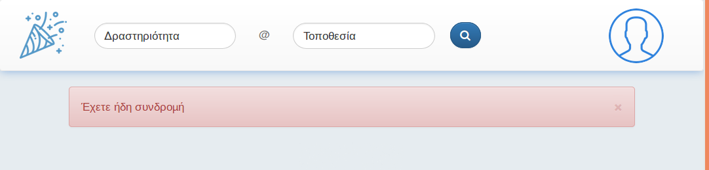

## Τι είναι τα flash messages

Τα flash messages είναι μικρά μυνήματα που θα εμφανίζονται στον χρήστη κάτω από το navbar, για να τον ενημερώσουν για ενέργειες που έγιναν.

#### Παράδειγμα

Αν ένας χρήστης που δεν έχει συνδρομή πάει να αγοράσει εισιτήριο, τον ανακατευθύνω στην σελίδα της συνδρομής. Όμως θέλω να του εμφανίσω ένα μήνυμα για να του εξηγήσω τι συνέβη. Η δομή του κώδικα είναι η εξής:

```javascript
// Route code - Parent doesn't have membership
req.flash('error', 'Δεν έχετε συνδρομή !');
// Redirect or Render 
res.redirect('/');
```

Ο χρήστης θα δει το εξής: 


#### Παράμετροι

Η χρήση του είναι πάρα πολύ απλή όπως το παράδειγμα. Τα μηνύματα μπαίνουν από το partial του navbar οπότε δεν θέλει καμία επιπλέον ρύθμιση ή require στα αρχεία.

Υπάρχουν 2 δυνατές παράμετροι για το 1ο όρισμα:
 * 'error': Εμφανίζει μηνύματα λάθους σε κόκκινο φόντο
 * 'success': Εμφανίζει μήνυμαατα επιτυχίας σε πράσινο φόντο

 #### Χρήσιμη Σημείωση
 
 Με res.redirect('back') μπορείς να πας τον χρήστη στην προηγούμενη σελίδα. 
